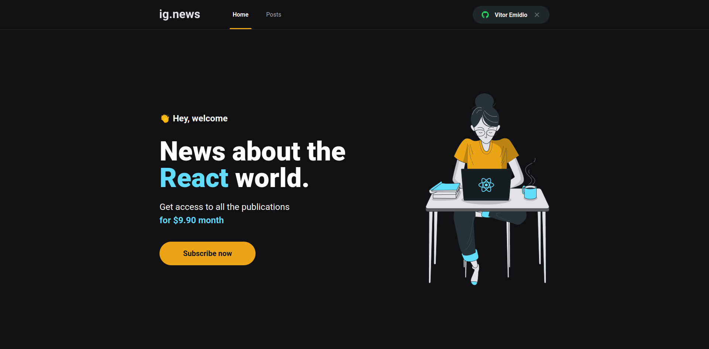
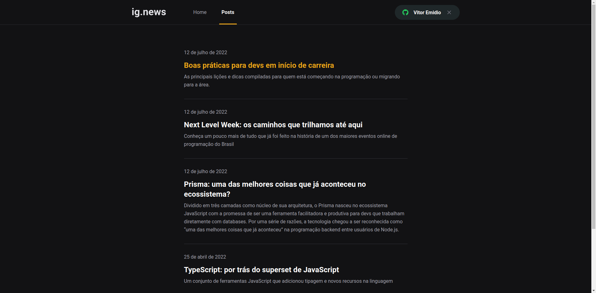
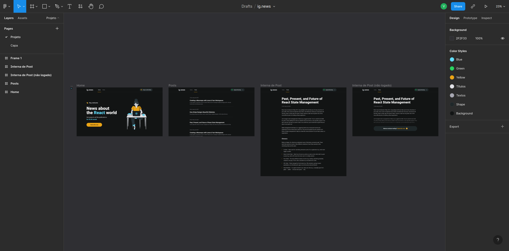
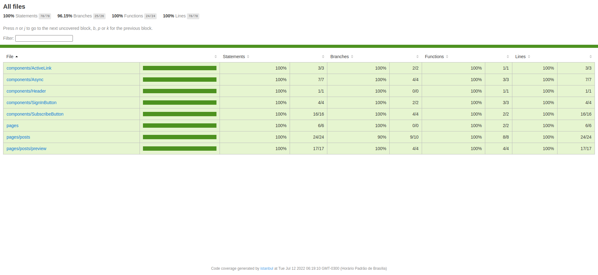

<h1 align="center">
   ig.news - ReactJS | 
</h1>

<p align="center">


</p>

---

**ig.news** é um projeto cujo objetivo é permitir aos usuários acessarem conteúdos do blog através de uma inscrição.

<p align="center">
  <a href="#-projeto">Projeto</a>&nbsp;&nbsp;&nbsp;|&nbsp;&nbsp;&nbsp;
  <a href="#-como-rodar-o-projeto">Como rodar o projeto</a>&nbsp;&nbsp;&nbsp;|&nbsp;&nbsp;&nbsp;
  <a href="#-tecnologias">Tecnologias</a>&nbsp;&nbsp;&nbsp;|&nbsp;&nbsp;&nbsp;
  <a href="#-extensões-vscode">Extensões VsCode</a>&nbsp;&nbsp;&nbsp;|&nbsp;&nbsp;&nbsp;
  <a href="#-layout">Layout</a>&nbsp;&nbsp;&nbsp;|&nbsp;&nbsp;&nbsp;
  <a href="#-licença">Licença</a>
</p>

## 💻 Projeto

Para o desenvolvimento do projeto foi utilizando [JAMStack](https://jamstack.org/) (JavaScript, API e Markup)

O framework selecionado foi [NextJS](https://nextjs.org/) aplicando conceitos como consumo de API externas, API Root, Server Side Rendering (SSR), Static Side Generation (SSG). Foi utilizado o [Stripe](https://stripe.com/br) como Gateway de Pagamento. Para autenticação, foi optado [NextAuth](https://next-auth.js.org/) com login social pelo Github. O Banco de dados escolhido para armazenar os dados foi o [FaunaDB](https://fauna.com/). E por último, mas não menos importante, teve o [Prismic CMS](https://prismic.io/) para adição, armazenamento e gerenciamento do conteúdos dos posts.



## 🧭 Como rodar o projeto

### 🚨 Requisitos

**Necessário realizar as instalações:**

- [Git](https://git-scm.com/)
- [Stripe CLI](https://stripe.com/docs/stripe-cli)
- [Yarn](https://classic.yarnpkg.com/lang/en/)

**Criar conta e configurar os serviços externos:**

- [FaunaDB](https://fauna.com/)
- [OAuth Apps Github](https://github.com/settings/developers)
- [Prismic](https://prismic.io/)
- [Stripe](https://stripe.com/br)

**Clone este repositório**

```bash
git clone https://github.com/vitorsemidio-dev/ignite-reactjs-ignews.git
```

**Acesse a pasta**

```bash
cd ignite-reactjs-ignews.git
```

### 🔑 Variáveis Ambiente

Criar arquivo `.env.local` e preencher os valores das variáveis de ambiente

```env
# FaunaDB
FAUNADB_API_KEY=
FAUNADB_DOMAIN=

# Github
GITHUB_ID=
GITHUB_SECRET=

# Next
NEXTAUTH_SECRET=
NEXTAUTH_URL=

# Prismic CMS
PRISMIC_ACCESS_TOKEN=
PRISMIC_API_URL=

# Stripe
STRIPE_API_KEY=
STRIPE_CANCEL_URL=
STRIPE_SUCCESS_URL=
STRIPE_WEBHOOK_SECRET=

# Stripe Public
NEXT_PUBLIC_STRIPE_PUBLIC_KEY=
```

**Instale as dependências**

```bash
yarn
```

**Execute a aplicação**

```bash
yarn dev
```

**Ouvir os webhooks**

```
stripe listen --forward-to localhost:3000/api/webhooks
```

## 🚀 Tecnologias

Esse projeto foi desenvolvido com as seguintes tecnologias:

- [FaunaDB](https://fauna.com/)
- [JAMStack](https://jamstack.org/)
- [Jest](https://jestjs.io/pt-BR/)
- [NextJS](https://nextjs.org/)
- [NextAuth](https://next-auth.js)
- [Prismic CMS](https://prismic.io/)
- [Sass](https://sass-lang.com/)
- [Stripe](https://stripe.com/br)


## 🔖 Layout

Você pode visualizar o layout do projeto através [desse link](https://www.figma.com/community/file/1120711251998877938). É necessário ter conta no [Figma](https://figma.com) para acessá-lo.



## 🧪 Testes

**Utilize o comando a seguir para rodar os testes:**

```bash
yarn test
```

```bash
yarn test:coverage
```



## 📝 Licença

Esse projeto está sob a licença MIT. Veja o arquivo [LICENSE](LICENSE) para mais detalhes.
